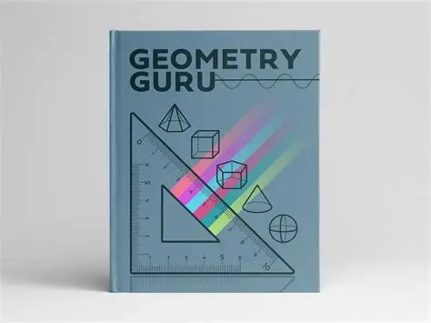

# 📐 Geometry Guru

**Geometry Guru** — bu foydalanuvchilarga turli geometrik shakllarning perimetrini oddiy matematik amallar (qo'shish, ko'paytirish) orqali hisoblashda yordam beradigan dastur.

### ✨ Imkoniyatlar:
*   **Kvadrat:** Tomonini 4 ga ko'paytirish orqali.
*   **To'g'ri to'rtburchak:** Uzunlik va kenglikni qo'shib, 2 ga ko'paytirish orqali.
*   **Uchburchak:** Barcha tomonlarini qo'shish orqali.

### 🚀 Ishlash jarayoni

### 🛠 Texnologiyalar:
*   **Til:** C# 
*   **Format:** Markdown