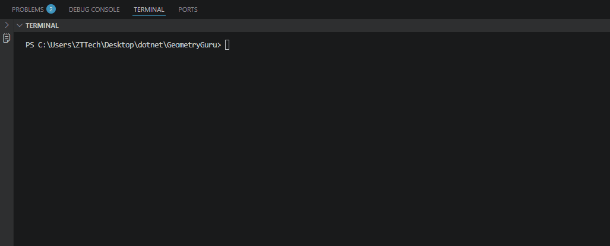

# 📐 Geometry Guru 

**Geometry Guru** — bu foydalanuvchilarga murakkab arifmetik hisob-kitoblar, geometrik shakllarning yuzasini hisoblash va sonli algoritmlar bilan ishlashda yordam beradigan konsol dasturi.

### ✨ Imkoniyatlar:

## 🔢 Arifmetik va Algoritmik amallar:
*   **Standart amallar:** Qo'shish (+), Ayirish (-), Ko'paytirish (*), Bo'lish (/).
*   **Darajaga ko'tarish (^):** Sonni ixtiyoriy butun darajaga ko'tarish (Sikl yordamida).
*   **Tub sonlar filtri:** 1 dan N gacha bo'lgan sonlar ichidan tublarini aniqlash va ularning yig'indisini hisoblash.

## 📐 Geometrik amallar (Yuzani hisoblash):
*   **Kvadrat:** Berilgan tomoni bo'yicha yuzasini hisoblash.
*   **Uchburchak:** Asosi va balandligi orqali yuzasini topish.
*   **Romb:** Diagonallari ko'paytmasi orqali yuzasini aniqlash.

---

### 🚀 Ishlash jarayoni

### 🛠 Texnologiyalar:
*   **Dasturlash tili:** C# (.NET Core)
*   **Format:** Markdown (Hujjatlashtirish uchun).

### 📖 Foydalanish yo'riqnomasi:
1. Dasturni ishga tushiring.
2. Asosiy menyudan kerakli bo'limni (1, 2 yoki 3) tanlang.
3. Arifmetik bo'limda birinchi navbatda **amalni** kiriting, so'ngra sonlarni kiriting.
4. Har bir amaldan so'ng menyuga qaytish uchun ixtiyoriy tugmani bosing.
5. Chiqish uchun **4** raqamini tanlang.